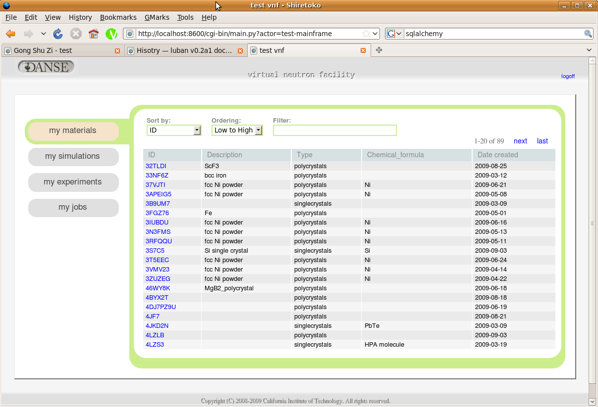
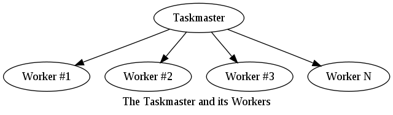

.. applications-that-use-pyre

Applications that use pyre
==========================

A number of applications use the pyre framework and are good examples of how to effectively employ components to make developmenet of scientific applications easier, more cost-effective, and less prone to architectual design flaws.  We discuss a few of those here.

.. _drchopsandpyre:

DrChops
-------

DrChops is a reduction package o reduce data from direct-geometry time-of-flight neutron chopper spectrometers. It benefits from pyre and is very flexible and meets needs of users of different
levels. 

.. image:: http://drchops.caltech.edu/Docs/docs/reduction/DeveloperGuide/html/figures/reduction-package-layers.png
   :width: 600px

The design of DrChops follows the guidelines of pyre software-engineering principles.
To ensure that the DrChops software is easy to use for novice users but still
flexible enough and not be a stopper for advanced users, the DrChops software
were built into several layers.

"c/c++" library
    "c/c++" layer is responsible for intensive computations only feasible to be implemented in low level language. For example, this layer includes a class ERebinAllInOne to rebin data in tof bins to data in evenly-spaced energy bins.
"python vector-compatible" function library
    "python vector compatible" layer vectorCompat is the joint point between c++ and python. All c++ codes are implemented to deal with "vector"-like objects, e.g., energy bins. The vectorCompat python package accepts vector arguments and call the corresponding c++ methods to do the real work. This layer separate other python layers from c++ codes and python bindings.
"python histogram-compatible" methods and classes
    "python histogram compatible" layer histCompat allows developers to deal with objects with more physics meanings. This layer is built on top of the vectorCompat layer. A histogram is an object consisting of axes and datasets and meta data. In the histCompat layer, histograms are our focus. Classes in this layer take histograms instead of vectors as arguments, and implementations of those classes decompose histograms to vectors and call the corresponding methods in the vectorCompat layer.
"reduction core" 
    The "reduction core" layer makes use of components in histCompat layer and implement classes that are more high-level. The histCompat layer is more concerned with low-level operations like "rebin to evenly-spaced energy bins" and "fit a curve to gaussian and find the center". The "reduction.core" layer is more concerned with "calculate calibration constants out of calibration data" and "reduce I(det, pix, tof) to S(phi,E)".
"pyre component"
    The "pyre component" layer makes use of methods and classes in the "reduction core" layer and provide those methods and classes easy access to user configurations. 

By careful design and decomposition of reduction procedures, the DrChops software is able to provide
novice users auto-generated GUI to pre-constructed reduction workflows; and also can provide
advanced users great flexibility of using different reduction components in pre-constructed
reduction workflows, or even modifying the reduction workflows by using command-line interface
or xml-based configuration files:

.. image:: http://drchops.caltech.edu/Docs/docs/reduction/DeveloperGuide/html/figures/reduction-package-layers-UIandComputation.png
   :width: 800px

.. _opal:

Opal
----

Opal is a basic web framework using pyre technology.  It's main application is Web Application:

.. inheritance-diagram:: opal.applications.WebApplication opal.applications.CGIParser
   :parts: 1

As a web framework, in it's inventory it has a special type of facility called opal.inventory.Actor:

.. inheritance-diagram:: opal.inventory.Actor
   :parts: 1

which processes subcomponents inheriting from opal.components.Actor, one of a few other components used in opal:

.. inheritance-diagram:: opal.components.Actor opal.components.AuthenticatingActor opal.components.GenericActor opal.components.Login opal.components.Logout opal.components.NYI opal.components.Registrar opal.components.Sentry
   :parts: 1

As a web framework, opal produces html from each actor.  Its html data structures include:

.. inheritance-diagram:: opal.content.Banner opal.content.Base opal.content.Body opal.content.Button opal.content.Checkbox opal.content.ControlBox opal.content.ControlBoxLine opal.content.CoreAttributes opal.content.Document opal.content.Element opal.content.ElementContainer opal.content.Form opal.content.FormControl opal.content.FormField opal.content.FormHiddenInput opal.content.Head opal.content.IncludedStyle opal.content.Input opal.content.KeyboardAttributes opal.content.LanguageAttributes opal.content.Link opal.content.Literal opal.content.LiteralFactory opal.content.Logo opal.content.Meta opal.content.Page opal.content.PageContent opal.content.PageCredits opal.content.PageFooter opal.content.PageHeader opal.content.PageLeftColumn opal.content.PageMain opal.content.PageRightColumn opal.content.PageSection opal.content.Paragraph opal.content.ParagraphFactory opal.content.PersonalTools opal.content.Portlet opal.content.PortletContent opal.content.PortletFactory opal.content.PortletLink opal.content.Preformatted opal.content.PreformattedFactory opal.content.Script opal.content.ScriptFactory opal.content.SearchBox opal.content.Selector opal.content.Style opal.content.TextArea opal.content.Title
   :parts: 1

When a user creates a python class subclassing opal.components.Actor which contains these data structures, weaver uses the visitor pattern to produce html from them using the following mills:

.. inheritance-diagram:: opal.weaver.BodyMill opal.weaver.ContentMill  opal.weaver.DocumentMill  opal.weaver.HeadMill  opal.weaver.PageMill  opal.weaver.StructuralMill  opal.weaver.TagMill 
   :parts: 1

.. Opal demo
  ^^^^^^^^^

  The best way to exlain opal is by executing it as a normal python application and then explaining how any server could run it.  So we create the following subclass of opal.components.Actor::

.. _luban_include:

Luban
-----

Luban is a generic user-interface specification language and builder. More information can be found in its `documentation <http://docs.danse.us/pyre/luban/sphinx/>`_.  

It has been used for the `Virtual Neutron Facility <http://dev.danse.us/trac/VNET>`_:

and has also been used to construct an interface builder called `Gongshuzhi <http://luban.danse.us/cgi-bin/gongshuzi/main.cgi>`_:

.. image:: _static/gongshuzhi.png
   :scale: 50

.. Here is a :ref:`test link<tutorials>` to its tutorials.

.. .. toctree::

   luban/Introduction
   luban/Installation
   luban/Tutorials
   luban/API
   luban/LubanApp
   luban/Gongshuzi
   luban/History

Cassandra
---------

Cassandra is a pyre taskmaster-worker service arrangement.  It takes a given task and divides up among N workers:

It is currently used in the `Computational Infrastructure for Geodynamics <http://www.geodynamics.org/cig/>`_.  More documentation about it can be found `here <http://crust.geodynamics.org/~leif/presentations/cassandra>`_.

