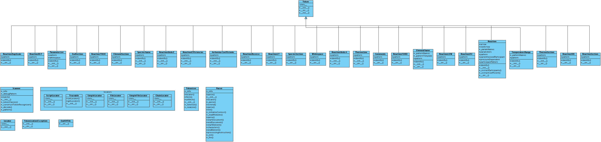
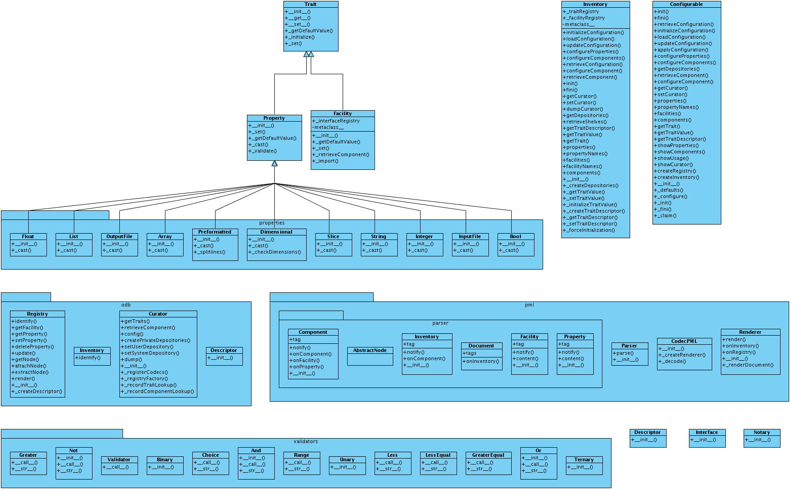

Advanced pyre: packages and internal structure
==============================================

.. _pyre-units:

pyre.units
----------

`pyre.units <http://danse.us/trac/pyre/browser/pythia-0.8/packages/pyre/pyre/units>`_ provides developers an easy way to work with quantities with units. It is fairly easy and intuitive to use. For example, to create velocity quantity of 3000 meter/second, you will do ::

    from pyre.units import time, length
    velocity = 3000 * length.meter/time.second

Modules
^^^^^^^

 * `angle <http://danse.us/trac/pyre/browser/pythia-0.8/packages/pyre/pyre/units/angle.py>`_
 * `time <http://danse.us/trac/pyre/browser/pythia-0.8/packages/pyre/pyre/units/time.py>`_
 * `length <http://danse.us/trac/pyre/browser/pythia-0.8/packages/pyre/pyre/units/length.py>`_
 * `mass <http://danse.us/trac/pyre/browser/pythia-0.8/packages/pyre/pyre/units/mass.py>`_
 * `substance <http://danse.us/trac/pyre/browser/pythia-0.8/packages/pyre/pyre/units/substance.py>`_
 * `SI <http://danse.us/trac/pyre/browser/pythia-0.8/packages/pyre/pyre/units/SI.py>`_
 * `area <http://danse.us/trac/pyre/browser/pythia-0.8/packages/pyre/pyre/units/area.py>`_
 * `volume <http://danse.us/trac/pyre/browser/pythia-0.8/packages/pyre/pyre/units/volume.py>`_
 * `density <http://danse.us/trac/pyre/browser/pythia-0.8/packages/pyre/pyre/units/density.py>`_
 * `speed <http://danse.us/trac/pyre/browser/pythia-0.8/packages/pyre/pyre/units/speed.py>`_
 * `force <http://danse.us/trac/pyre/browser/pythia-0.8/packages/pyre/pyre/units/force.py>`_
 * `pressure <http://danse.us/trac/pyre/browser/pythia-0.8/packages/pyre/pyre/units/pressure.py>`_
 * `energy <http://danse.us/trac/pyre/browser/pythia-0.8/packages/pyre/pyre/units/energy.py>`_
 * `power <http://danse.us/trac/pyre/browser/pythia-0.8/packages/pyre/pyre/units/power.py>`_

.. _pyre-db:

pyre.db
-------

Pyre contains the groundwork for an Object Relational Mapper (ORM) in pyre.db.  A class diagram is:

.. image:: images/PyreDbClassDiagram.png

As apparent, pyre

= vnf dom =
The user inputs accepted from user interface must be stored somewhere for later use. In opal, this is done with the help of pyre.db, the db engine in pyre framework.

VNF extends pyre.db to support the hierarchial data structure needed by VNF. The hierarchy in VNF DOM is established by connecting db tables with "references". 
Furthermore, since VNF makes use of polymorphic pointers in various places, a special reference type, VersatileReference, is introduced into VNF DOM.

== simple data structures ==
A simple data structure with hierarchy can be easily built from a pyre.db table. Following is an example:

{{{
from Table import Table as base
class Cylinder(base):

    name = 'cylinders'

    import pyre.db

    idd = pyre.db.varchar(name="id", length=64)
    id.constraints = 'PRIMARY KEY'

    height = pyre.db.real( name = 'height', default = 0.1 )
    innerradius = pyre.db.real( name = 'innerradius', default = 0.0 )
    outerradius = pyre.db.real( name = 'outerradius', default = 0.002 )
}}}

This table describes cylinders with parameters height, innerradius, and outerradius.  In the `pyre project dsaw<http://, DbManager is overlaid with additional functionality for creating hierarchical data structures.

.. _pyre-geometry:

pyre.geometry
-------------

Here is the class diagram:

.. image:: images/PyreGeometryClassDiagram.png

.. _pyre-parsing:

pyre.parsing
-------------

Here is the class diagram for pyre's parsing utilities:

.. _pyre-services:

pyre.services
-------------

Here is the class diagram for pyre's services base:

.. image:: images/PyreServicesClassDiagram.png

.. _pyre-xml:

Pyre's xml processor: pyre.xml
------------------------------

Here is the class diagram:

.. image:: images/PyreGeometryClassDiagram.png

.. _pyre-pyre:

Pyre internal structure: pyre.pyre
----------------------------------

Pyre has a complex internal structure.  Here are some class diagrams:

Here is how it handles internally inventory items:

Here is how it

.._journal-structure:

Journal: structure and architecture 
-----------------------------------

Here is the class diagram of journal:

.. image:: images/JournalTopLevelClassDiagram.png

