.. _pyrePackages:

Pyre libraries
==============

.. _pyre-units:

Automatic unit conversion: pyre.units
-------------------------------------

`pyre.units <http://danse.us/trac/pyre/browser/pythia-0.8/packages/pyre/pyre/units>`_ provides a no-brainer for unit conversion. For example, to create velocity quantity of 3000 meter/second, you will do ::

    from pyre.units import time, length
    velocity = 3000 * length.meter/time.second

A list of the units that are possible include:

.. automodule:: pyre.units.angle
   :members:
   :undoc-members:

Modules
^^^^^^^

 * `angle <http://danse.us/trac/pyre/browser/pythia-0.8/packages/pyre/pyre/units/angle.py>`_
 * `time <http://danse.us/trac/pyre/browser/pythia-0.8/packages/pyre/pyre/units/time.py>`_
 * `length <http://danse.us/trac/pyre/browser/pythia-0.8/packages/pyre/pyre/units/length.py>`_
 * `mass <http://danse.us/trac/pyre/browser/pythia-0.8/packages/pyre/pyre/units/mass.py>`_
 * `substance <http://danse.us/trac/pyre/browser/pythia-0.8/packages/pyre/pyre/units/substance.py>`_
 * `SI <http://danse.us/trac/pyre/browser/pythia-0.8/packages/pyre/pyre/units/SI.py>`_
 * `area <http://danse.us/trac/pyre/browser/pythia-0.8/packages/pyre/pyre/units/area.py>`_
 * `volume <http://danse.us/trac/pyre/browser/pythia-0.8/packages/pyre/pyre/units/volume.py>`_
 * `density <http://danse.us/trac/pyre/browser/pythia-0.8/packages/pyre/pyre/units/density.py>`_
 * `speed <http://danse.us/trac/pyre/browser/pythia-0.8/packages/pyre/pyre/units/speed.py>`_
 * `force <http://danse.us/trac/pyre/browser/pythia-0.8/packages/pyre/pyre/units/force.py>`_
 * `pressure <http://danse.us/trac/pyre/browser/pythia-0.8/packages/pyre/pyre/units/pressure.py>`_
 * `energy <http://danse.us/trac/pyre/browser/pythia-0.8/packages/pyre/pyre/units/energy.py>`_
 * `power <http://danse.us/trac/pyre/browser/pythia-0.8/packages/pyre/pyre/units/power.py>`_

Here are some of the classes used by these data structures:

.. inheritance-diagram:: pyre.units
   :parts: 2

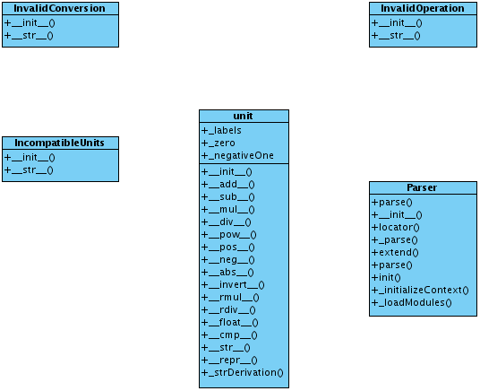

.. _pyre-db:

Database access and object storage: pyre.db
-------------------------------------------

Pyre contains the groundwork for an Object Relational Mapper (ORM) in pyre.db.  A class diagram is:

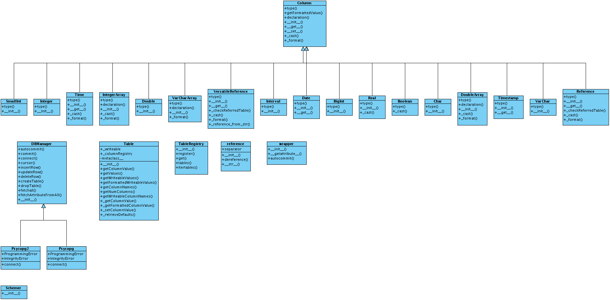

or 

.. inheritance-diagram:: pyre.db
   :parts: 2

As apparent, pyre.db offers a number of variable types (inheriting from "Column"), which are part of "Table".  These are managed by a subclass of DBManager, currently implemented with a postgres db backend by "Psycopg2", for example, which overrides DBManager's commit() method.  This class name is also the name of the python wrapper for postgres.

To store objects in a db, one must subclass "Table", such as::

    from Table import Table as base
    class Cylinder(base):
    
        name = 'cylinders'
    
        import pyre.db
    
        idd = pyre.db.varchar(name="id", length=64)
        id.constraints = 'PRIMARY KEY'
    
        height = pyre.db.real( name = 'height', default = 0.1 )
        innerradius = pyre.db.real( name = 'innerradius', default = 0.0 )
        outerradius = pyre.db.real( name = 'outerradius', default = 0.002 )

This table describes cylinders with parameters height, innerradius, and outerradius.  In the `pyre project dsaw <http://danse.us/trac/pyre/browser/branches/patches-from-jiao/packages/dsaw>`_, DbManager is overlaid with additional functionality for creating hierarchical data structures.  

Then users can store objects in the usual way::

    >>> dbm = DbManager()
    >>> dbm.createTable(Cylinder)
    >>> cylinder = Cylinder()
    >>> dbm.insertRow(cylinder)

as well as execute other methods in the DbManager interface.

.. _pyre-geometry:

Constructive solid geometry: pyre.geometry
------------------------------------------

(note: the internal classes of the packages need to be removed)

Pyre.geometry is a complex collection of geometry-related classes and utilities.  Let us examine the class structure.  Here is the top level diagram:

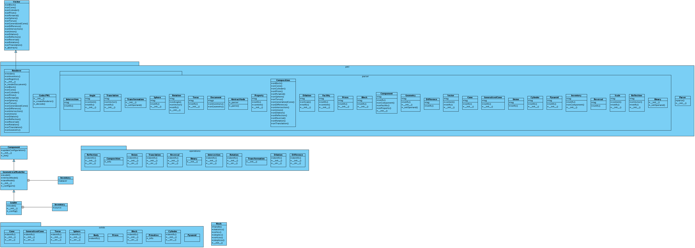

In the solids package we see the differing geometrical solids available to pyre users:

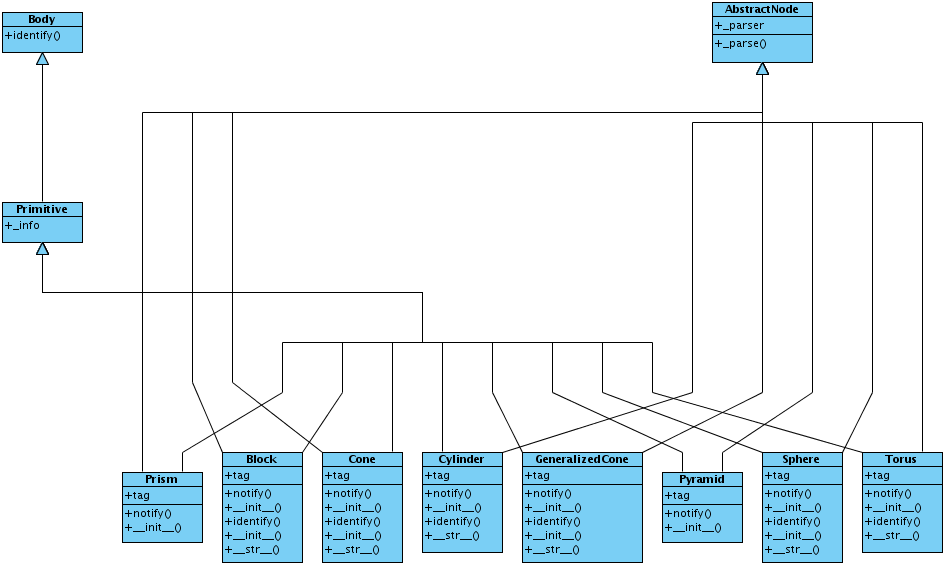

In the operations package we have:

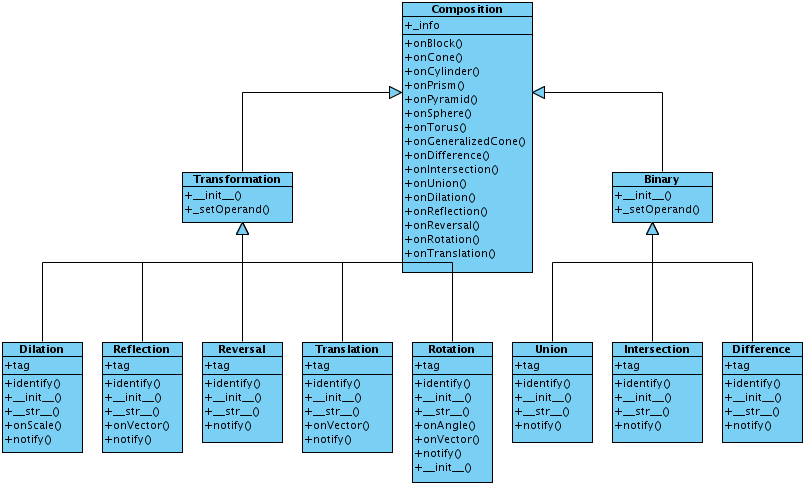

where we see the types of boolean operations that can be done on basic geometrical shapes.  In the pml package we have:

.. image:: images/PyreGeometryPmlClassDiagram.png

where we see classes related to rendering and parsing pml files for geometrical structure objects.  In the pml.parsing:

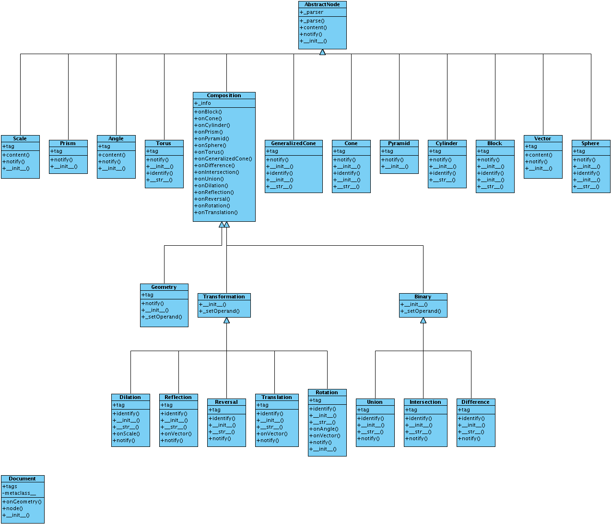

.. inheritance-diagram:: pyre.xml.Node pyre.xml.Parser pyre.xml.Document pyre.xml.DTDBuilder 
   :parts: 1

there are :ref:`weaver-like<weaver>` classes using the visitor pattern to render and parse data in pml format about the geometrical objects.

.. _pyre-xml:

Pyre's xml processor: pyre.xml
------------------------------

Here is the class diagram:

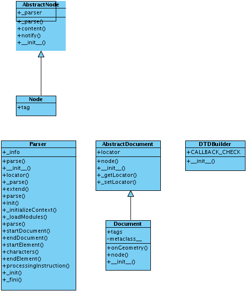

.. inheritance-diagram:: pyre.xml.Node pyre.xml.Parser pyre.xml.Document pyre.xml.DTDBuilder 
   :parts: 1

.. _pyre-services:

Pyre server base: pyre.services
-------------------------------

Here is the class diagram for pyre's services base:

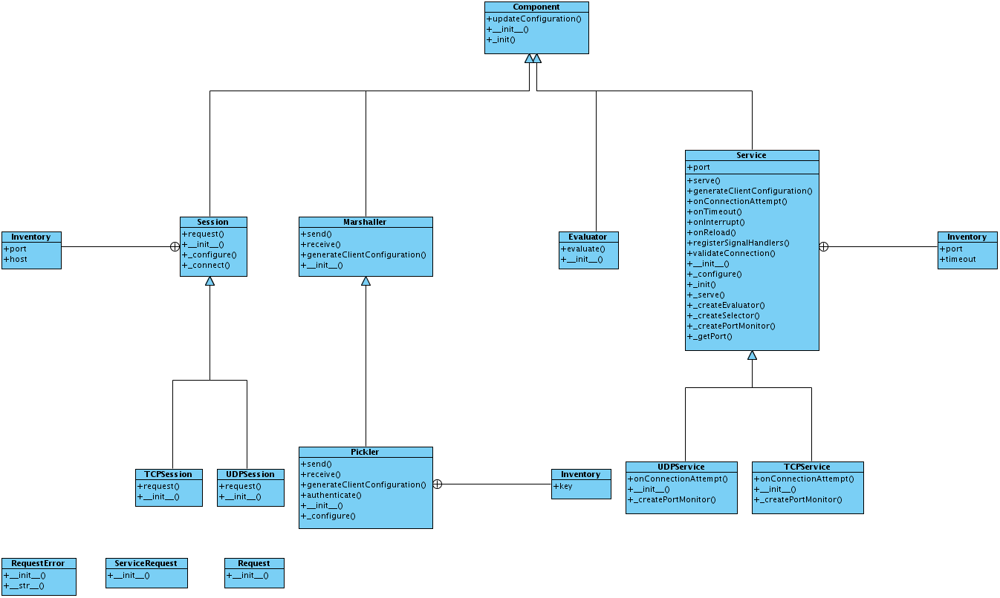

.. inheritance-diagram:: pyre.services.UDPService pyre.services.TCPService pyre.services.Evaluator pyre.services.Pickler pyre.services.TCPSession pyre.services.UDPSession
   :parts: 1

These classes are useful when creating servers that need to provide a type of service, as shown for idd, ipa, and ipc in the next sections.

.. _idd:

Generating globally unique identifiers: pyre.idd
------------------------------------------------

Idd is a daemon which issues globally unique identifiers.  Here is its class diagram:

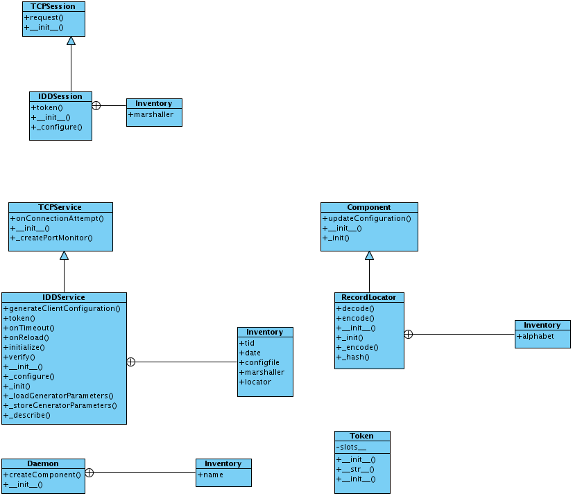

Objects that need a unique identifier simply use this as a facility and configure it::

    class Inventory(Base.Inventory):
        import pyre.idd
        idd = pyre.inventory.facility('idd-session', factory=pyre.idd.session, args=['idd-session'])
        idd.meta['tip'] = "access to the token server"

    def _configure(self):
        self.idd = self.inventory.idd

then obtain the identifier::

    id = self.idd.token().locator

.. _ipa:

Managing user sessions: pyre.ipa
--------------------------------

Ipa is a daemon which can manage user sessions by creating hashes, issuing tickets, and verifying passwords. Here is the class diagram:

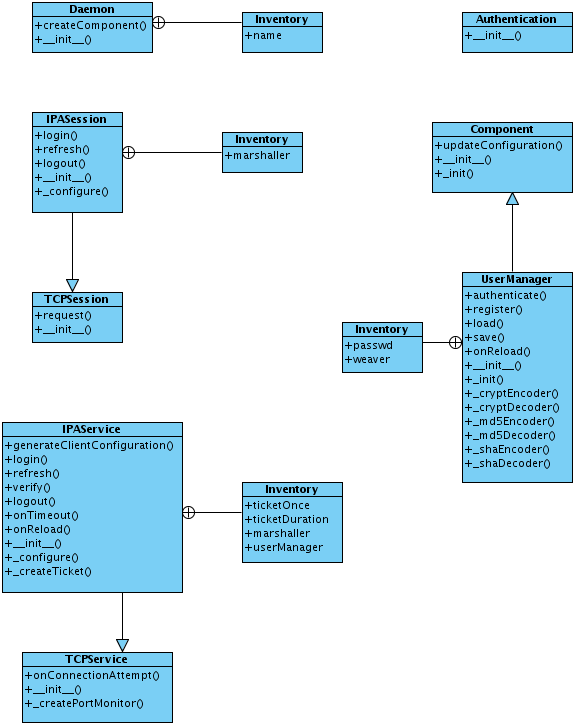

* need a good example of how Ipa is used...try Sentry here...

.. _ipc:

Pyre.ipc
--------

Here is the class diagram for pyre.ipc:

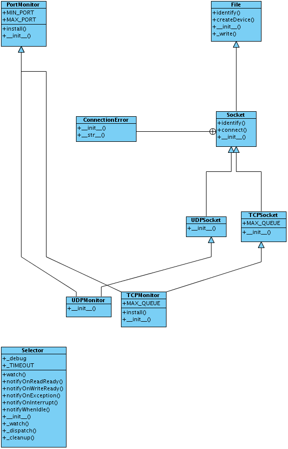

.. _pyre-simulations: 

Running and steering simulations in pyre: pyre.simulations
----------------------------------------------------------

Here are tools for running simulations with pyre (mostly finite element for now):

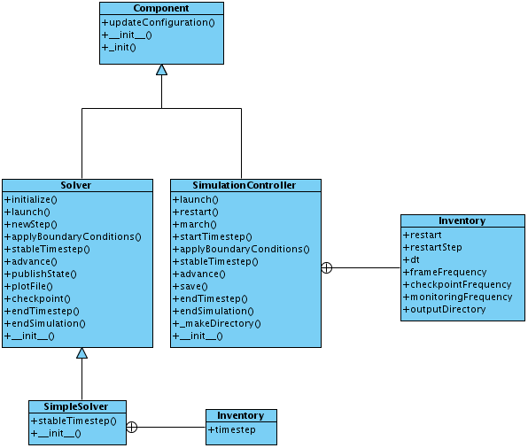

.. inheritance-diagram:: pyre.simulations.SimpleSolver pyre.simulations.SimulationController
   :parts: 1

.. _pyre-util:

Pyre utilities
--------------

Here are various utilities, such as the base class, Singleton, for the singleton design pattern:

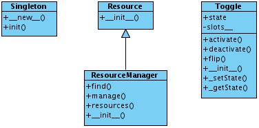

.. inheritance-diagram:: pyre.util.Singleton pyre.util.ResourceManager pyre.util.Toggle
   :parts: 1

.. _createPyreProject:

Tutorial: Creating your own pyre project
========================================

We now discuss how to create your own pyre project by reviewing typical pyre project structre and some useful Make.mm directives.

.. _pyre-directory-structure:

Pyre project structure
----------------------

A pyre project typically contains a number of directories.  For example, supposing one creates a pyre project with <package> as it's name:

* applications/

  Pyre applications typically are put in this directory with a :ref:`Make.mm <make-mm>` that exports them to the pythia-0.8/bin directory.  :ref:`Pyre convention <pyre-style>` appends a "d" to the app name if it is a service daemon.  

* etc/

  This directory stores facility factory method files, called :ref:`odb files <odb-pml-files>`, for switching facilities at run time.  The internal structure of etc/ mirrors the structure of the application and its components.  For example suppose the application is called MdApp with the inventory::

    class MdApp(Script):
    
        class Inventory(Script.Inventory):
            import pyre.inventory as inv 
            mdEngine = inv.facility('mdEngine', default='gulp')
            mdEngine.meta['known_plugins'] = ['gulp','mmtk','lammps','cp2k']
            mdEngine.meta['tip'] = 'which md engine to use'

  Then etc/ would have the structure::

    $ ls etc
    Make.mm MdApp
    $ ls etc/MdApp
    gulp.odb mmtk.odb lammps.odb cp2k.odb
    
* <package>/

  This is the top level directory for python source.

* lib<package>/

  This contains possible c extensions.

* <package>module/

  This contains python bindings to the c extensions.

* tests/

  Tests for all parts of the project.

Although this directory structure is not mandatory, it is somewhat conventional.  Much of this structure can be generated automatically by using the :ref:`package utility<create-a-pyre-project>`. 

When creating one's own pyre project, one must learn some internals of the Make.mm build system.  Here we overview some of them.  The rest may be learned by reading config files such as .

Directives/options/macros used in Make.mm
-----------------------------------------

Make.mm format is similar to that of typical linux shell scripting.  A few macros which may be useful are:

 * export-python-package 

 * others to be included

While coding the new pyre project, one may also need to debug.  Pyre's native debugger is called journal.

.. _journal:

Journal
-------

Pyre's native debugger is called journal.
It allows developers to insert journalling instructions in their code that produce
pyre application diagnostics such as
error reporting, warnings, and debugging.

To create a journal channel and write to it include something like the following::

  >>> import journal
  >>> debug = journal.debug('myproject')
  >>> debug.activate()
  >>> debug.log( 'This is a debugging message' )

which gives the output::

   >> <stdin>:1:<module>
   >> myproject(debug)
   -- This is a debugging message
  <journal.diagnostics.Diagnostic.Diagnostic object at 0x956910>

The factory ::

  journal.debug

creates journal channels of "debug" type. And this call::

  journal.debug("myproject")

creates a journal debug channel named "myproject".
The call::

  >>> debug.activate()

activates this channel.
And now you are ready to output to the newly created journal stream::

  >>> debug.log( 'This is a debugging message' )

Journal types
^^^^^^^^^^^^^
Following types are available
 * debug: debugging information. Default off.
 * error: unrecoverable runtime error. Default on.
 * firewall: fatal programming error. Default on.
 * info: descriptive information. Default off.
 * warning: recoverable runtime error. Default off.

Journal devices
^^^^^^^^^^^^^^^

Journals can be easily directed to different devices. By default, journal
writes to a terminal-like device that directly outputs to screen.
Another very useful device is a journal daemon.

Journal daemon
""""""""""""""
It is also a good model of a pyre application as discussed in :ref:`a section on advanced pyre <journal-structure>`.  Because journal is a daemon, it produces debugging info for all application types, whether distributed or local.

To start using journal daemon, first execute the journal daemon by typing::

    $ journald.py	

from the command line.  (also talk about having the right pml files set up and making sure journal is "pointing" to them).  Then insert the following at the top of your pyre app::

    import journal
    journal.info(name).activate()
    journal.debug("journal").activate()

Then in the constructor, information about the code part may be labeled in order to discern which, of the many parts of your code, is outputting the information::

    i = journal.info(codepart)
    d = journal.debug(codepart)

and as the need arises, insert debugging statements in your code::

    i.log(something-you'd-like-to-see)
    d.log(something-you'd-like-to-see)

Journaling for pyre components
^^^^^^^^^^^^^^^^^^^^^^^^^^^^^^

Journaling channels are automatically set up for all pyre components.
In Configurable.py, a superclass of Component.py::

    def __init__(self, name):
	...
        self._info = journal.info(name)
        self._debug = journal.debug(name)

so that if one desires to debug pyre components or pyre scripts, one only has to call::

    self._debug.log(something-you'd-like-to-see)

and make sure they turn "on" debug or info output for that component.  For example, this can be done with a journal.pml file in one's config directory::

.. _debugger:

Debuggers
---------

In addition to journal, and especially for routine debugging of individual components, interactive debuggers (such as in Eclipse) may be useful.  Pyre is particularly amenable to this type of testing since all parameters may be input via the commandline, which in Eclipse may be stored as run configurations.  

In Eclipse these run configuration can also be exported ("Shared File" under the "Common" tab) and archived or shared among developers.  Additionally, each time a developer changes the run configuration, Eclipse automatically updates the exported files.

.. _mcvine:

Science Tutorial: Conducting a virtual neutron experiment
=========================================================

An interesting problem in scattering science is how to simulate neutron scattering.  Typically this is done via a large number virtual neutrons randomly being projected toward a virtual sample represented by a scattering kernel.

