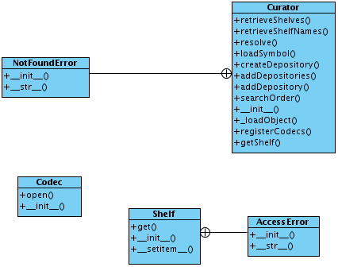
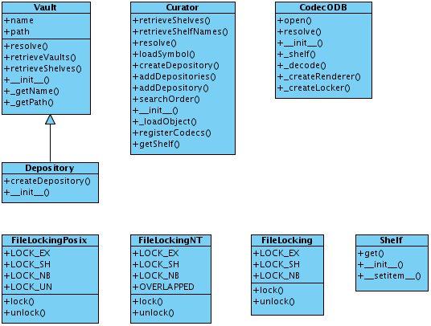
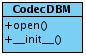
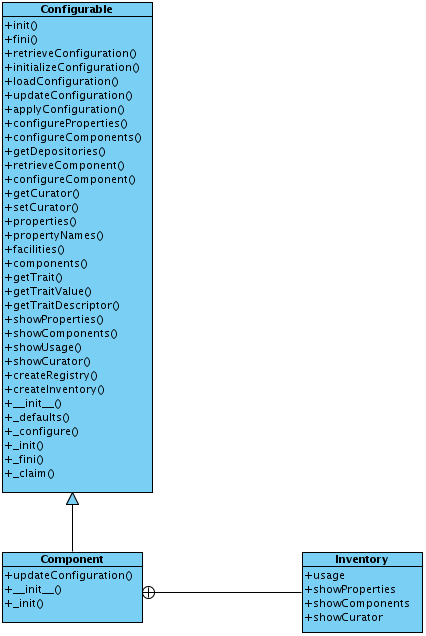
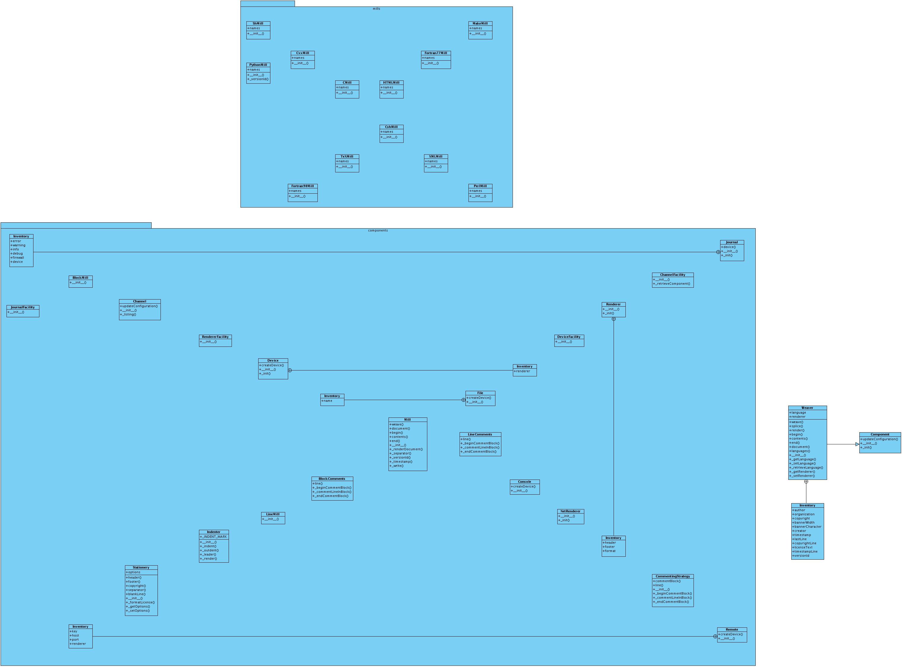
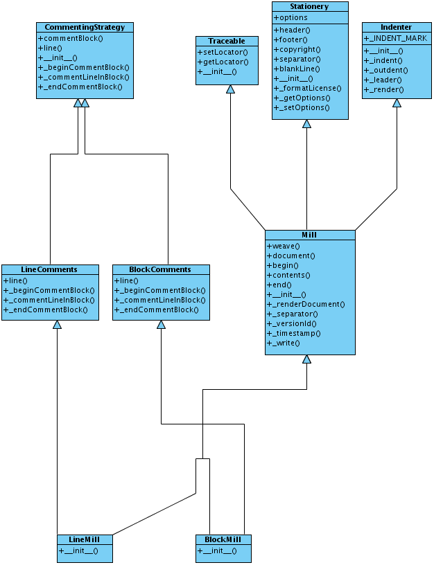
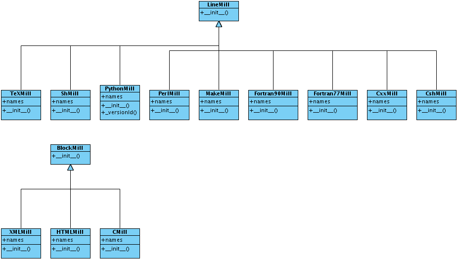

Advanced pyre II: pyre internal structure
=========================================

Pyre has a complex internal structure.  Here we discuss some of it's internal workings for the benefit of those who would like to extend it.

Intneral structure of inventory and odb handling
------------------------------------------------

Here is how it handles internally inventory items:

.. image:: images/PyreInventoryClassDiagram.png

Here is how it handles the common parts of odb and db-type files:

Here is how it handles odb files:

and db-type "files":

This appears to be a stub.  Real db interaction is managed by :ref:`pyre.db <pyre-db>`.

.. _pyre-components:

pyre.components
-------------

Here is the class diagram for pyre's component:

.. _pyre-parsing:

pyre.parsing
-------------

Here is the class diagram for pyre's parsing utilities:

.. image:: images/PyreParsingClassDiagram.png

It's classes in turn use locators for the files they parse:

.. image:: images/PyreParsingLocatorsClassDiagram.png

.. _pyre-filesystem:

pyre.parsing
-------------

Here is the class diagram for pyre's parsing utilities:

.. image:: images/PyreParsingClassDiagram.png

.. _weaver-structure:

Struture of pyre's weaver rendering utility
-------------------------------------------

This is a structural discussion of weaver.  See :ref:`<weaver>` for the purpose of weaver and how to extend it.  Here is its class diagram:

Here is the class diagram for weaver's componenets:

Here are its internal mills (classes that "render" pyre data structures):

